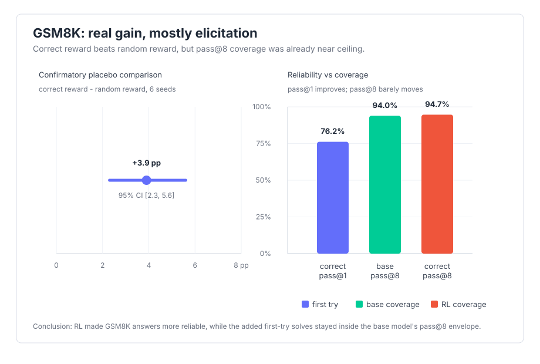
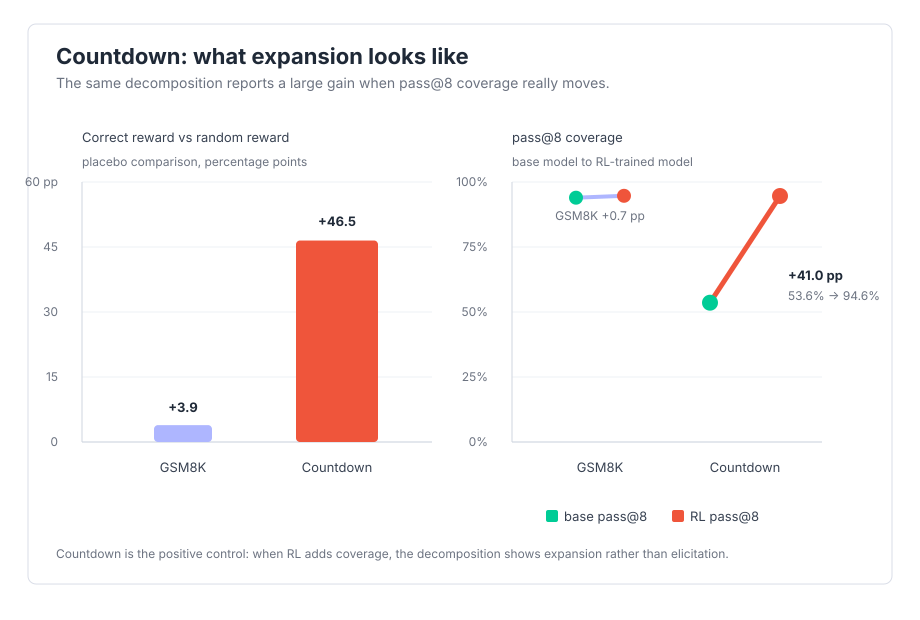

# grpo-decomp + llm_grpo_gains

This repo is two packages with one boundary:

- **`grpo_decomp`** — a controls-first **harness** for decomposing a GRPO benchmark gain
  into real reasoning vs. contamination, formatting, and elicitation. It is task- and
  model-agnostic: bring your own model and task and plug them in through registries.
- **`llm_grpo_gains`** — the **reference study** that exercises the harness on GSM8K (the
  primary panel) plus a generated Countdown positive control.

The harness asks the question the reward curve cannot answer:

**Did the model learn new reasoning, or did training mostly make existing answers
come out more often?**

On GSM8K (the reference study), the answer is mostly the second one. GRPO gives a real
gain, but the base model already has nearly all of the coverage at pass@8. The training
mainly turns reachable answers into more reliable first tries.

Countdown is the sanity check. It uses the same protocol on a generated search
task where the base model actually lacks coverage, and there GRPO does expand
what the model can solve — proving the method detects real expansion when it exists.

## Result

On GSM8K, the correctness reward beats a random-reward placebo by **+3.9 pp,
95% CI [2.3, 5.6]** across six seeds. That is a real effect. It is not, by
itself, much evidence of new reasoning.

Why:

- **The base already has the coverage.** base pass@8 (94.0%) is above correct
  pass@1 (76.2%).
- **Coverage barely moves.** correct pass@8 changes by Δ +0.7 pp, with propagated
  95% CI [-0.4, +1.9].
- **Per problem, 0.0% of the GSM8K gain is new capability.** The trained model
  gets more reliable on problems inside the base pass@8 envelope.
- **The envelope survives decontamination.** On renumbered GSM-Symbolic problems,
  base pass@8 holds at 90.8%.
- **CoT-gated pass@k is not useful for these completions.** Qwen has 0.0%
  verifiable-chain coverage here, so the `<<a op b = c>>` proxy never fires.



Countdown checks that the method can detect real expansion. With the same
measurement, the placebo comparison is **+46.5 pp, 95% CI [21.4, 71.6]**, and
pass@8 moves by **Δ +41.0 pp, 95% CI [38.3, 43.7]**: base 53.6% → correct 94.6%.
Per problem, **10.9% on Countdown** is genuinely new capability.



The detailed writeups are in:

- [`results/FINDINGS.md`](results/FINDINGS.md) for the main GSM8K panel
- [`results/countdown/FINDINGS.md`](results/countdown/FINDINGS.md) for Countdown
- [`results/decontam/FINDINGS.md`](results/decontam/FINDINGS.md) for decontamination

## What Is In The Repo

The **harness** (`src/grpo_decomp/`) is the measurement method, not a general RL framework:

- GRPO training launcher + config, and generation (transformers / vLLM backends)
- `CompletionSet` artifacts that separate generation from offline analysis
- grading, pass@k, CoT-gated pass@k, behavior checks, and paired statistics
- the seeded **random placebo** reward (the control the whole method leans on)
- the registries (`grpo_decomp/registries.py`) a task plugs into: eval sets, train
  datasets, rewards, verifiers, held-out reconstructors, prompt strategies, task profiles

The **study** (`src/llm_grpo_gains/`) is what makes those numbers concrete:

- loaders for GSM8K, GSM-Symbolic, GSM-Plus, GSM8K-Platinum, and generated Countdown
- verifiable rewards for correctness and Countdown
- the arm `configs/`, committed result JSON and figures, and `registration.py` (the wiring)

Full trained checkpoints and completion sets are not committed. They live on the
Modal `assay-runs` volume. The JSON under [`results/`](results/) is enough to
check the published numbers and rebuild the figures.

## Plug In Your Own Model + Task

The harness is built to take your own RL'd model and task without a fork. Point `--model`
(or `ArmConfig.base_model`) at any Hugging Face id or checkpoint path, and register the
task by writing a `register()` that fills the harness registries:

```python
from grpo_decomp.registries import register_eval_set, register_train_dataset, register_reward

def register() -> None:
    register_eval_set("my-test", load_my_test)            # a `generate --set` target
    register_train_dataset(TrainDataset("my-task", load_my_train_and_validation))
    register_reward("my-reward", lambda seed: my_reward)  # verifiable; share the signature
    # ...register_verifier / register_validation_reconstructor / register_prompt_strategy as needed
```

Declare it under the `grpo_decomp.plugins` entry-point group (see `pyproject.toml`) so the
CLI and Modal discover it. The chat-template case is one `register_prompt_strategy` away;
the default `r1_zero` strategy is for base models with no chat template.
[`src/llm_grpo_gains/registration.py`](src/llm_grpo_gains/registration.py) is the worked example.

## How It Works

Training and analysis are separate.

1. Train one arm: base model, reward, seed, and dataset are recorded in provenance.
2. Generate completions from the base model and trained checkpoints.
3. Freeze those completions as `CompletionSet` directories.
4. Run grading, statistics, and reporting offline on CPU.

Only generation needs a model backend. Once a `CompletionSet` exists, analysis is
deterministic and needs no GPU, no network, and no Hugging Face access.

For the machinery, read [`docs/ARCHITECTURE.md`](docs/ARCHITECTURE.md). For Modal
training and result regeneration, read [`docs/RUNBOOK.md`](docs/RUNBOOK.md).

## Install

```bash
make install
```

This installs the CPU environment: data, rewards, eval, stats, reports, and tests.

Optional extras:

```bash
uv sync --extra generate  # local transformers generation
uv sync --extra train     # GPU training stack: TRL + vLLM + wandb
```

## Check The Results

Rebuild the figures and check README/FINDINGS numbers against the JSON artifacts:

```bash
make results
```

Run the normal local gate:

```bash
make check
```

`make check` runs Ruff, unit tests, and the docs-to-JSON guard.

## Try The Eval Path

`make demo` scores two tiny committed `CompletionSet` fixtures. It does not load a
model.

```bash
make demo
```

Expected: base `strict_accuracy = 0.3333333333333333`; correct
`strict_accuracy = 0.5`.

To generate a small local completion set with `transformers`:

```bash
uv sync --extra generate
grpo-decomp generate \
  --model Qwen/Qwen2.5-Math-1.5B \
  --set dev \
  --backend transformers \
  --out runs/base__dev
grpo-decomp battery --completions runs/base__dev --k 1
```

## CLI

`grpo-decomp` exposes the artifact boundary directly.

- `generate`: load a model and write a `CompletionSet`
- `battery`: score a `CompletionSet`
- `report`: build a single-seed decomposition table
- `report-seeds`, `report-passk-seeds`, `report-mechanism`,
  `report-control-seeds`: aggregate the multi-seed panels
- `heldout`: select checkpoints from held-out accuracy, not reward curves

Example:

```bash
grpo-decomp report --completions-dir runs/ --out results/
```

The expected local layout is `<arm>__<set>`, for example `base__gsm8k-test` and
`correct__gsm-symbolic`.

## Training

Training runs on Modal with a single A100/H100-class GPU. The Modal app records
provenance, checkpoints, held-out curves, and generated completion sets on the
`assay-runs` volume.

```bash
modal run --detach modal_app.py --arm configs/correct.yaml
modal run --detach modal_app.py --arm configs/correct.yaml --command heldout
```

For Modal auth, the W&B secret, smoke runs, volume pulls, and JSON regeneration,
use [`docs/RUNBOOK.md`](docs/RUNBOOK.md).

## Rules Of The Study

- no headline gain without controls, confidence intervals, and paired tests
- aggregate over seeds before making a claim
- record dataset revisions, model revisions, config, commit, dependency versions,
  and sampling settings
- treat reward curves as debugging signals, not evidence
- make skipped records, malformed artifacts, and unparseable completions visible

## Stack

Python 3.11+ · `uv` · Pydantic · TRL GRPO · transformers · vLLM · Modal ·
[`eval-audit`](https://github.com/adamthuvesen/eval-audit)

## License

MIT
