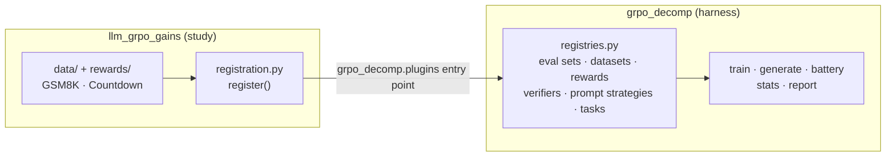
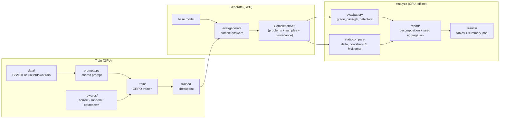
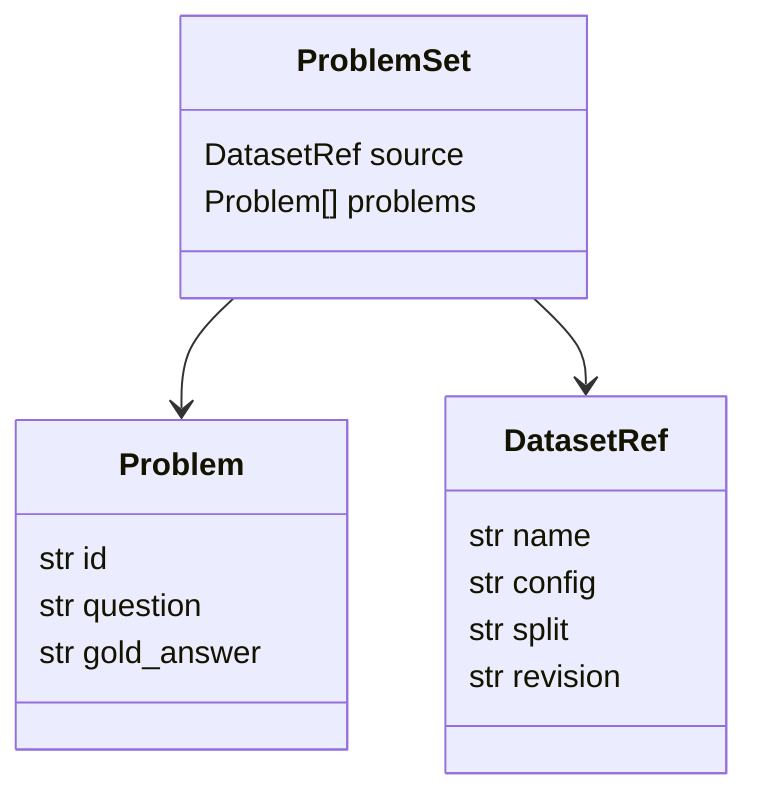
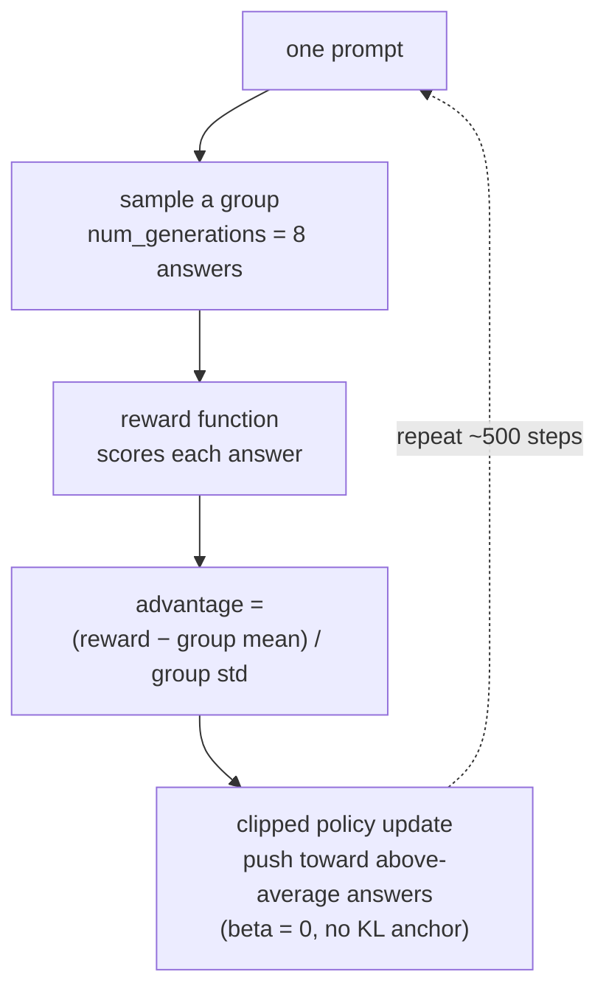
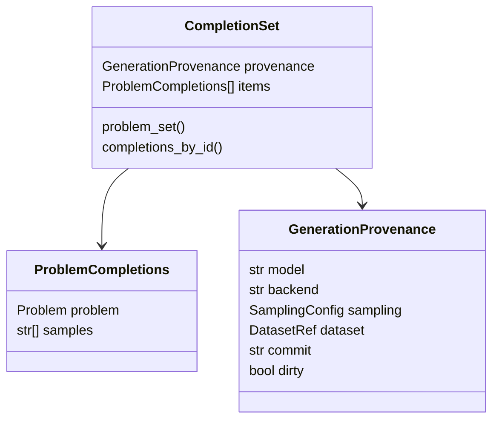
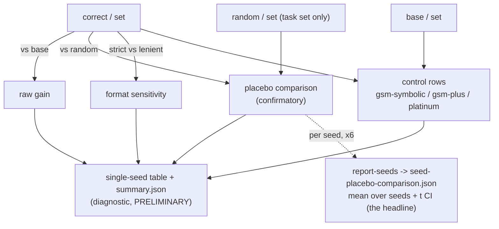
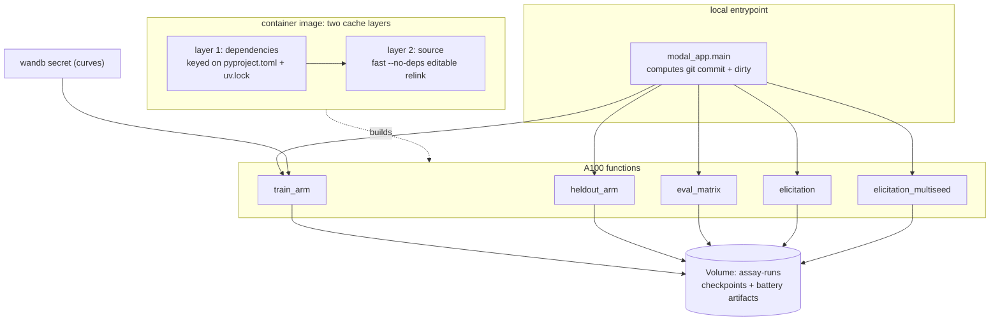

# Architecture: grpo-decomp + llm_grpo_gains

The codebase is **two packages with a one-way boundary**:

- **`grpo_decomp`** — the harness. It trains a GRPO arm, samples completions, grades them,
  and runs an adversarial decomposition that tries to explain away the benchmark gain:
  "how much of the gain is real reasoning, and how much is elicitation, contamination,
  formatting, or noise?". It is task- and model-agnostic.
- **`llm_grpo_gains`** — the reference study. It instantiates the harness on GSM8K (the
  primary panel) and a generated Countdown positive control, supplying the datasets,
  verifiable rewards, configs, results, and the `registration.py` that wires them in.

The controls are the product; a headline number without its controls is treated as
worthless. The harness never imports the study — a study (or a new RL task) injects its
concrete pieces through the registries in `grpo_decomp/registries.py`, discovered at
startup via a `grpo_decomp.plugins` entry point (`grpo_decomp/plugins.py`). That seam is
what lets the harness point at your own model and task without a fork.



---

## Study Design

Three workflow stages. Training produces models, generation turns models into
graded answers, and offline analysis turns graded answers into a defensible claim.
The boundary between generation and analysis is a self-contained artifact
(`CompletionSet`), so generation runs on a GPU and all analysis runs offline on a CPU.

The same pipeline runs two tasks. **GSM8K** (grade-school math on the
`Qwen2.5-Math-1.5B` base) is the primary decomposition. **Countdown** (a generated
search task on the general `Qwen2.5-1.5B` base) is the positive control: a skill the
base genuinely lacks, so it shows the decomposition can detect real capability
_expansion_, not only _elicitation_. Both share the loaders, rewards, prompt, eval
battery, and statistics below; only the dataset and reward change.



---

## Design rules that shaped the code

These are constraints, not preferences. They explain why some modules look the way
they do.

- **The training reward is not evidence.** A rising reward curve is expected even
  from a placebo. Only held-out evaluation, completion length, and entropy count.
- **Every headline number carries a confidence interval and a paired significance
  test.** Never a bare point estimate. See `stats/`.
- **Never claim from one training run.** Results aggregate over seeds; below three
  seeds a result is labelled preliminary.
- **Determinism where it matters.** Fixed seeds, pinned dataset revisions, and a
  recorded model/commit/config/dependency fingerprint on every artifact.
- **Reject or report silent failures.** Unparseable completions, skipped records, and
  data-quality exclusions are logged or rejected, never quietly dropped.
- **Strict schemas.** Result types are frozen Pydantic models that reject unknown
  fields (`schemas.Record`), so a malformed artifact fails at the boundary.

---

## Module map

Harness — `src/grpo_decomp/`:

| Module           | Responsibility                                                                                              |
| ---------------- | ----------------------------------------------------------------------------------------------------------- |
| `schemas.py`     | The shared frozen types: `DatasetRef`, `Problem`, `ProblemSet`.                                             |
| `registries.py`  | The plug-in surface: eval sets, train datasets, rewards, verifiers, validation reconstructors, prompt strategies, task profiles + `ARMS`. |
| `plugins.py`     | Loads study `register()`s from the `grpo_decomp.plugins` entry-point group.                                 |
| `prompts.py`     | Prompt strategies (`PromptStrategy`); ships the built-in `r1_zero`. Train and eval use the _same_ strategy. |
| `splits.py`      | Deterministic `dev_slice` / `validation_split` over a `ProblemSet`.                                         |
| `provenance.py`  | Git commit/dirty state and pinned dependency versions.                                                      |
| `rewards/`       | `get_reward` (registry-resolved) + the harness-provided `random` placebo control.                          |
| `train/`         | GRPO config, the run launcher, and run provenance.                                                          |
| `eval/`          | Generation, the completion artifact, grading, pass@k, detectors, CLI.                                       |
| `stats/`         | Paired comparison: delta + bootstrap CI (via `eval-audit`), McNemar and Holm (local).                       |
| `report/`        | The single-seed decomposition table plus the multi-seed aggregators (placebo, pass@k, mechanism, controls). |

Study — `src/llm_grpo_gains/` (+ repo-root `configs/`, `results/`, `modal_app.py`):

| Module             | Responsibility                                                                            |
| ------------------ | ----------------------------------------------------------------------------------------- |
| `data/`            | Load or generate each source (GSM8K family, Countdown) as a canonical `ProblemSet`.       |
| `rewards/`         | The verifiable graders `correct` and `countdown` (one shared signature).                  |
| `registration.py`  | `register()`: wires the study's datasets/rewards/verifiers/task profiles into the harness. |
| `configs/`         | One YAML per (arm, seed).                                                                  |
| `results/`         | Committed outputs: decomposition table, `summary.json`, findings.                          |
| `modal_app.py`     | Rents an A100 on Modal and runs the GPU steps (loads the study plugin).                    |

The dependency direction is one-way: the study depends on the harness, never the reverse
(a standalone-import check enforces it). Within the harness, `schemas`/`registries` sit at
the bottom, `eval`/`train` depend on them, `stats` depends on nothing GPU, and `report`
sits on top of `stats` and `eval`. Heavy GPU imports (`trl`, `vllm`, `torch`) are lazy —
imported inside the function that needs them — so the analysis path imports on a
laptop with no CUDA.

---

## Data layer

Every source reduces to one canonical `ProblemSet` of `Problem`s
(`id`, `question`, `gold_answer`). Each HuggingFace loader pins an immutable dataset
revision (a commit SHA) so the benchmark never changes silently underneath a result;
Countdown is generated from a fixed seed instead.

- `gsm8k`: the training and primary test set (grade-school word problems).
- `gsm_symbolic`: the same problems with renumbered values (checks memorization).
- `gsm_plus`: adversarially perturbed problems (checks robustness). The loader
  excludes the "unanswerable / critical-thinking" items explicitly (it logs the
  count) rather than scoring them as wrong.
- `gsm8k_platinum`: a relabeled, cleaned GSM8K test (checks label noise).
- `countdown`: the positive-control task. Procedurally _generated_ (not loaded from
  HuggingFace), so it is uncontaminated by construction. Each problem encodes its
  `(numbers, target)` key in `gold_answer`, and a restricted AST evaluator (the four
  operators, exact `Fraction` arithmetic, never `eval`) both grades answers and
  guarantees every target is reachable.
- `splits.py`: `validation_split` (a deterministic held-out subset keyed on seed +
  size) and `dev_slice` (a small fixed subset for local checks).



---

## Reward layer

All rewards share one signature: they take the generated `completions` plus
forwarded dataset columns (such as `gold_answer`) and return one score per
completion (or `None` to skip a sample). An arm differs from another arm by exactly
one word in its config (`ArmConfig.reward`), resolved through the reward registry by
`grpo_decomp.rewards.get_reward`. The harness provides the **placebo**; the study
registers the verifiable rewards.

- **`random`** (harness, `grpo_decomp/rewards/placebo.py`): the placebo. A uniform value
  in `[0, 1)` per completion from a seeded RNG, blind to both the completion and the gold.
  Built once per run so the RNG sequence is reproducible. This is the control the whole
  method leans on, so it lives in the harness, not a study.
- **`correct`** (study): verifiable exact-match correctness on math, no partial credit.
  The answer is read from the final `\\boxed{...}` via the same `extract_strict`
  path as headline strict accuracy (then graded with `math-verify`, so `1,000` equals
  `1000` and `3/4` equals `0.75`). Unparseable (unboxed) completions score
  `0.0` (treated as wrong, not skipped) because under `beta=0` there is no KL
  anchor to discourage degenerate output. A high unparseable rate is logged as a
  reward-hacking warning.
- **`countdown`** (study): verifiable search correctness for the positive control. Parses
  the model's boxed expression with the restricted evaluator in `data/countdown.py`
  and checks it reaches the target using each source number at most once.

Grading at eval time mirrors this: `grpo_decomp.registries.verifier_for(source)` returns
the harness default (math-verify on the boxed answer) unless a study registered an override
for that `DatasetRef.name` (Countdown does). A format reward is deliberately absent — on
this substrate it is itself a confound.

---

## Training layer

`train/config.py` defines the arm. `GRPOSettings` follows the DeepSeek-R1-Zero
recipe: `beta=0` (no KL penalty, no reference model), `num_generations=8`,
`learning_rate=1e-6`, `max_completion_length=1024`, `max_steps=500`,
`save_steps=100`, and colocated vLLM rollouts. `ArmConfig` adds `name`,
`base_model` (+ pinned revision), `reward`, `seed`, `dataset` (`gsm8k` or
`countdown`), and `checkpoint_selection` (`final` or
`best_on_validation`).

`train/launcher.py` runs one arm end to end: load the arm's training set (GSM8K,
or the generated Countdown set for the positive control), hold out a validation
split (GSM8K carves a per-seed split out of train; Countdown ships a dedicated,
seed-independent one), build the prompt dataset, pick the reward, construct the
TRL `GRPOTrainer`, train, save the final checkpoint, and tear down the process
group cleanly. It writes a `RunProvenance` record before training starts.

### How one GRPO step learns

GRPO removes the value network that ordinary PPO needs. Instead it samples a group
of answers to the same prompt and scores each one relative to the group's own
average. There is no separate judge model.



A consequence worth knowing: if all eight answers get the same reward (all correct,
or all wrong), the group's standard deviation is zero, the advantage is zero, and
that prompt contributes no gradient. On a nearly-saturated benchmark this wastes a
large fraction of each batch, and it is visible in the `frac_reward_zero_std` log.

---

## Evaluation layer

The boundary between generation and analysis is the **`CompletionSet`**: a directory
holding a `provenance.json` and a `completions.jsonl`. It carries each `Problem`
(so the gold answer travels with the answers) plus its sampled completions, so the
analysis side needs no network and no dataset re-pinning. Generation is the only
step that loads a model.



- `generate.py`: one interface, two backends. `transformers` for local CPU/MPS
  generation, `vllm` for CUDA generation. Both draw on the same training
  prompt and stop on the model's native end-of-text token, so evaluation measures
  the model on the distribution it trained on. Greedy decoding with `n>1` raises an
  explicit error (it would return identical samples).
- `answers.py`: two extraction policies. **strict** reads only the final
  `\boxed{...}`; **lenient** falls back to the last number if nothing is boxed.
  Lenient is a strict superset, so strict accuracy is always at most lenient
  accuracy, and the gap between them _is_ the format-sensitivity signal.
- `battery.py` turns a `CompletionSet` into a `BatteryResult`: strict and lenient
  pass@1, unbiased pass@k, a code-reasoning frequency, and chain coverage.
- `passk.py`: the unbiased pass@k estimator.
- `code_reasoning.py` / `cot.py` are the detectors: did the model solve by emitting
  program-style reasoning, and does its chain contain verifiable steps.
- `cli.py` is the `grpo-decomp` entry point. Eight subcommands: `generate`,
  `battery`, and `report` (the single-seed table), plus the multi-seed
  aggregators `report-seeds` (placebo), `report-passk-seeds` (pass@k coverage),
  `report-mechanism` (per-problem migration), `report-control-seeds` (the
  Holm-corrected §3 controls), and `heldout` (the held-out curve).

The **held-out curve** (`heldout` / `heldout_arm`) scores every saved checkpoint of
a finished run on its validation split, writes `heldout.json`, then realizes the
pre-registered `checkpoint_selection` rule and records the chosen step back into the
run's provenance. This is the only signal used to pick a checkpoint when the rule is
`best_on_validation`; production arms default to `final` (end-of-training checkpoint)
and skip held-out selection unless configured otherwise. Never use the training reward
for checkpoint choice.

Generation and held-out scoring share one token budget: `EVAL_MAX_NEW_TOKENS` (1024),
matching `max_completion_length`, so checkpoint curves and the decomposition battery
use the same completion length.

---

## Decomposition and statistics

The single-seed `report` command consumes a directory of `CompletionSet`s named
`<arm>__<set>` (for example `correct__gsm8k-test`). It groups them by set and arm
and builds one `Comparison` per question, each carrying a paired bootstrap CI and
a McNemar p-value (`stats/compare.py`, with the bootstrap delegated to
`eval-audit`). A comparison requires both arms to cover the same problem ids, so a
misalignment is a clear error, never a silent positional mismatch. This produces
the per-seed `summary.json` + `decomposition.md` — a diagnostic, flagged
`[PRELIMINARY]` because one run's CI reflects evaluation sampling only.



Two things to keep straight when reading the output:

- **Only the placebo comparison is confirmatory.** Every other row is descriptive, and
  its CI is per-row (marginal), not corrected for multiple comparisons. A single
  row crossing p<0.05 is not a confirmed finding.
- **Seed aggregation is the headline.** A single run's CI reflects evaluation
  sampling only. The committed headline numbers come from four multi-seed
  aggregators that recompute their metric per seed and aggregate at the seed level
  (mean with a t-interval over seeds), so the interval also reflects run-to-run
  variance. Below three seeds the result stays preliminary.

### The committed multi-seed artifacts

Each FINDINGS number traces to one aggregator → one JSON in `results/` (the
`scripts/make_figures.py` figures and the docs↔JSON consistency test read these, never the
single-seed table):

| Aggregator (`grpo-decomp …`) | Module                    | Artifact                       | What it backs                                                                                                                   |
| ---------------------------- | ------------------------- | ------------------------------ | ------------------------------------------------------------------------------------------------------------------------------- |
| `report-seeds`               | `report/seeds.py`         | `seed-placebo-comparison.json` | The confirmatory placebo delta (correct − random), seed-level t CI.                                                             |
| `report-passk-seeds`         | `report/passk_seeds.py`   | `pass8-multiseed.json`         | pass@k coverage: base anchor (problem-bootstrap CI) vs per-seed correct, with the propagated Δ interval and the CoT-gated twin. |
| `report-mechanism`           | `report/mechanism.py`     | `mechanism.json`               | Per-problem migration vs new capability + the completion-length shift.                                                          |
| `report-control-seeds`       | `report/control_seeds.py` | `decomposition-multiseed.json` | The §3 controls (gsm-symbolic / gsm-plus / gsm8k-platinum), Holm-corrected across the family.                                   |

The Countdown positive control and the decontamination panels reuse the same
aggregators over `countdown/` and `decontam/` `CompletionSet`s.

---

## Provenance and determinism

Every result artifact records what produced it: base model and revision, reward,
dataset revision, seed, the full GRPO config, the code commit, whether the working
tree was dirty, the Python version, and pinned dependency versions (TRL's behavior
moves between versions, so its version is part of the record). `RunProvenance`
covers training; `GenerationProvenance` covers evaluation. The same fingerprint is
what lets a held-out curve, a decomposition, and a seed aggregate all be traced
back to one commit.

---

## Execution on Modal

The GPU steps run on a single A100 rented through Modal. `modal_app.py` defines the
image and five A100 functions; the local entrypoint computes the git commit/dirty
state (the image strips `.git`) and passes it in, so a cloud run is still traceable
to the code that produced it.



- **The image is split on purpose.** Dependencies install in a layer keyed only on
  `pyproject.toml` + `uv.lock` (via `uv export`), and the source copies in a later
  layer that ends with a `--no-deps` editable relink. Editing source re-runs only
  the fast relink, never the multi-gigabyte GPU-stack download.
- **`train_arm`** trains one arm and commits checkpoints + provenance to the Volume.
- **`heldout_arm`** scores a finished run's checkpoints and records the selection.
- **`eval_matrix`** generates the greedy (pass@1) decomposition battery, with three
  scopes. `scope=full` (seed 0) covers base/correct/random over the task set plus
  the three control sets; `scope=placebo` (replicate seeds) covers just the
  correct-vs-random pair on the task set, which is all an extra placebo seed needs;
  `scope=controls` (replicate seeds) covers just the correct arm on the control
  sets — the per-seed upgrade of the seed-0 control rows (base is seed-independent,
  reused from seed 0), feeding the Holm-corrected §3 table.
- **`elicitation`** samples base and correct (seed 0) with `n>1` to measure pass@k:
  whether the gain is new capability or capability the base already had.
- **`elicitation_multiseed`** generalizes that panel so the verdict does not rest
  on one seed: a base anchor sampled once plus every correct training seed, with an
  optional `set_name` to re-run the same checkpoints off a control distribution. It
  produced the committed `passk-multiseed` panels and the decontamination cells.

The three eval functions (`eval_matrix`, `elicitation`, `elicitation_multiseed`)
take a `task` (`gsm8k` or `countdown`); `_eval_task` maps it to the base config,
eval set, control sets, and run-name prefix. GSM8K carries the three
perturbation/clean-label controls and unprefixed run dirs; Countdown has no
controls and uses `countdown-`-prefixed runs.

---

## Repository layout

```
grpo-decomp/
├── src/grpo_decomp/             # the harness (task-agnostic)
│   ├── schemas.py               # frozen shared types
│   ├── registries.py            # the plug-in surface (datasets, rewards, verifiers, ...)
│   ├── plugins.py               # entry-point loader for study register()s
│   ├── prompts.py               # PromptStrategy + the built-in r1_zero
│   ├── splits.py                # dev_slice, validation_split
│   ├── provenance.py            # git + dependency fingerprint
│   ├── rewards/                 # get_reward + the random placebo control
│   ├── train/                   # config, launcher, run provenance
│   ├── eval/                    # generate, completions, battery, passk,
│   │                            #   cot, code_reasoning, answers, cli
│   ├── stats/                   # compare, bootstrap, significance (McNemar + Holm)
│   └── report/                  # decomposition, render, seeds, passk_seeds,
│                                #   mechanism, control_seeds
├── src/llm_grpo_gains/          # the reference study (depends on grpo_decomp)
│   ├── data/                    # GSM8K + control-set loaders (pinned) + generated Countdown
│   ├── rewards/                 # correct, countdown (verifiable graders)
│   └── registration.py          # wires the study into the harness registries
├── configs/                     # one YAML per (arm, seed)
├── results/                     # committed tables, summary.json, findings
├── modal_app.py                 # Modal image + GPU functions + entrypoint
└── docs/                        # this document
```

## A reader's path through the code

1. `grpo_decomp/schemas.py` and `llm_grpo_gains/data/gsm8k.py`: what a problem is and where it comes from.
2. `grpo_decomp/registries.py` and `llm_grpo_gains/registration.py`: the plug-in seam and how the study fills it.
3. `llm_grpo_gains/rewards/correct.py` and `grpo_decomp/rewards/placebo.py`: the real grader and the placebo.
4. `grpo_decomp/train/config.py` and `grpo_decomp/train/launcher.py`: how an arm is configured and run.
5. `grpo_decomp/eval/completions.py`: the artifact that separates generation from analysis.
6. `grpo_decomp/eval/cli.py`: how generation, grading, and the report are driven.
7. `grpo_decomp/stats/compare.py` and `grpo_decomp/report/decomposition.py`: how a gain becomes a claim.
8. `grpo_decomp/report/seeds.py` and its siblings (`passk_seeds`, `mechanism`,
   `control_seeds`): how claims survive run-to-run variance.
