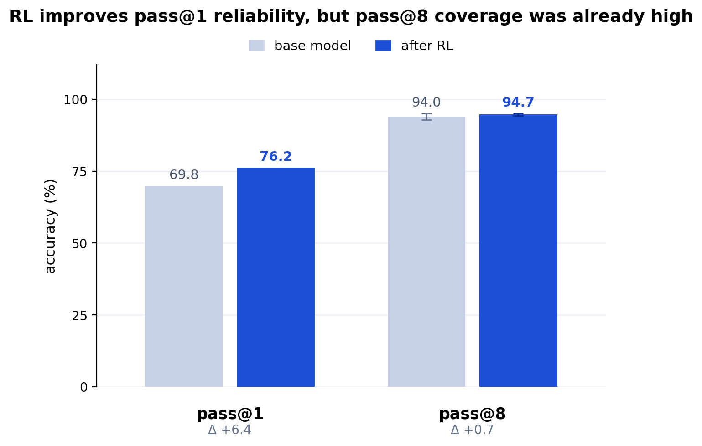
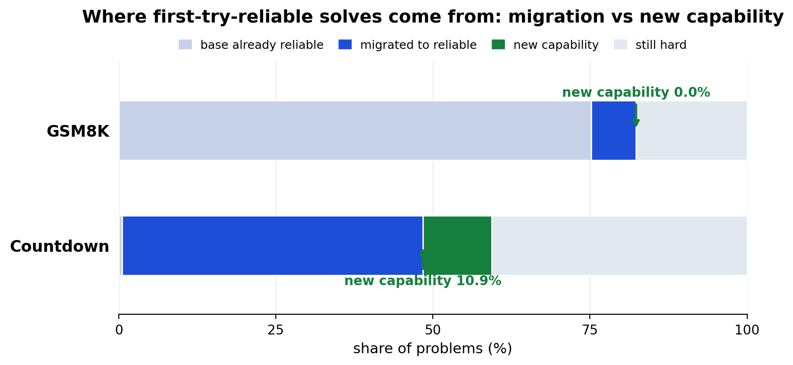

# grpo-decomp findings (Qwen2.5-Math-1.5B, GRPO on GSM8K)

Placebo comparison: **6 seeds per arm**; GSM8K-test (n=1319); pass@1 greedy, 1024-token budget,
lenient extraction. The pass@k coverage panel is now **6 seeds** too (base n=16 / correct n=8,
temp 0.7); the §3 controls are now **6 seeds** too (Holm-corrected). Commit-pinned artifacts:
`seed-placebo-comparison.json` (6-seed), `pass8-multiseed.json` (6-seed pass@k),
`mechanism.json` (per-problem migration), `decomposition-multiseed.json` (6-seed
Holm-corrected controls), `summary.json` (seed-0 full decomposition), `decomposition.md`.

## Headline (controlled)

A **small (~+4pp), correctness-driven, and statistically significant** GSM8K gain that
is nonetheless **mostly elicitation** of latent base capability, not new reasoning, not
contamination, not formatting. Two corrections to the single-seed read: the seed-0
number (+6.1pp, McNemar p=3e-9) **overstated the magnitude** (six seeds settle it at
**+3.9pp [2.3, 5.6]**), and the **6-seed** pass@k panel shows pass@8 coverage barely moves
(Δ **+0.7pp**, propagated CI **[−0.4, +1.9]** — consistent with zero): the gain is the model
getting more **reliable at problems it could already solve**, not new coverage. GSM8K is
near-saturated for this base (base pass@8 = 94%).

![Placebo comparison over 6 seeds: +3.9 pp [2.3, 5.6]](fig-placebo-comparison.png)

*Figures regenerate from the committed JSON via `uv run --with matplotlib python scripts/make_figures.py`.*

## 1. Placebo comparison across seeds (the pre-registered confirmatory test)

correct − random, 6 seeds → mean **+3.9 pp**, 95% CI **[2.3, 5.6]** (seed-level t, df=5).
**Significant**: the interval excludes zero, and all 6 seeds are positive.

| seed | random | correct | Δ (pp) |
| --- | --- | --- | --- |
| 0 | 75.3% | 81.4% | +6.1 |
| 1 | 74.5% | 78.6% | +4.2 |
| 2 | 76.6% | 78.6% | +2.0 |
| 3 | 77.0% | 79.5% | +2.4 |
| 4 | 76.0% | 79.9% | +3.9 |
| 5 | 75.6% | 80.7% | +5.1 |

- **Seeds were the deciding factor.** The seed-level CI tightened 3 → 5 → 6 seeds:
  [−1.1, +9.3] (crossed zero) → [+1.7, +5.8] → **[+2.3, +5.6]**. The 3-seed "not
  significant" was underpowered, not negative; more seeds resolved it.
- **The placebo genuinely doesn't help.** Random is flat at ~74.5–77.0% across every seed
  (≈ base 76.4%, and ~0.6pp *below* base on average). Seed 0's `correct` (81.4%) was the
  lucky high; the seed-aggregated per-seed gain is ~+2–6pp.
- Seed-averaged: base 76.4%, **random 75.8%**, **correct 79.8%** (+3.4 over base,
  +3.9 over placebo).

## 2. Elicitation: new capability or surfaced capability? (6 seeds, base n=16 / correct n=8, temp 0.7)

correct pass@8 over **6 seeds** vs the seed-independent base pass@8 anchor
(`pass8-multiseed.json`). pass@8 coverage **barely moves**: Δ **+0.7 pp**, propagated 95% CI
**[−0.4, +1.9]** (the base anchor's sampling CI folded into the between-seed interval, below) —
**consistent with zero**. This was the study's one load-bearing single-seed claim; it is now
multi-seeded, on the same footing as the placebo comparison, and it *shrank*: the single-seed
panel's +1.7 pp was the seed-0 high.

| arm | pass@1 (sampled) | pass@8 | code-reasoning freq |
| --- | --- | --- | --- |
| base | 69.8% | **94.0%** [92.9, 95.0] | 85.4% |
| correct (6-seed mean) | 76.2% | 94.7% [94.3, 95.1] | 83.1% |

- **base pass@8 (94.0%) ≫ correct pass@1 (76.2%)**: given 8 tries, the base already solves
  almost everything the RL model produces in one sampled try. The gain lives **inside the base's
  pass@k coverage** — RL improved pass@1 reliability, it did not expand capability.
- **correct pass@8 ≈ base pass@8**: the between-seed interval is [+0.4, +1.1], but it holds the
  base *fixed*; the base anchor's own problem-sampling CI (94.0% [92.9, 95.0]) is the **dominant**
  term, so the honest propagated interval **[−0.4, +1.9] is consistent with zero**. The verdict
  does not hinge on the sign: the GSM8K and Countdown propagated intervals (**[−0.4, +1.9]** vs
  **[+35.1, +46.9]**) do not come close to overlapping. This is the *bounded-small* reading —
  pass@8 coverage does not meaningfully move. All six correct seeds cluster at 94.2–95.2%
  (near-ceiling; n=8 resolves the between-seed panel, no escalation needed).
- **The style shift does not replicate.** The published seed-0 panel's code-reasoning drop
  (84% → 63%) was a seed-0 idiosyncrasy: across six seeds correct code-reasoning is **83.1%**
  (per-seed 63–91%) vs base 85.4% — essentially no shift, with only seed 0 at 63%. This is
  another seed-0 result that does not hold under aggregation.
- **Decontaminated — the envelope is not memorization.** Re-running this panel on **renumbered**
  problems (GSM-Symbolic) and **cleaned labels** (GSM8K-Platinum) leaves base pass@8 high
  (**90.8%** / **95.6%**) and far above correct pass@1, and Δ pass@8 small (**+1.8** / **+0.8**
  pp). Renumbering craters base pass@1 (memorization) but barely touches the pass@8 envelope the
  verdict rests on, so "base already solves it at pass@8" is genuine capability, not leaked
  answers. Full panel in [`decontam/FINDINGS.md`](decontam/FINDINGS.md).
- `elicitation.json` is retained as the historical seed-0 panel.

### CoT-gated pass@k: the verifiable-chain yardstick reads 0 here (coverage limit, not verdict)

The pass@k critique this study cites ([CoT-Pass@K, 2506.14245](https://arxiv.org/abs/2506.14245))
argues pass@k can reward a lucky final answer, so a solve should be gated on a *verified*
reasoning chain. We compute CoT-gated pass@k with the standard non-neural check — a sample
counts only with >=1 valid `<<a op b = c>>` calculator step — and it is **0.0%** for base and
correct alike, because **chain coverage is 0.0%**: not one base completion (16 per problem)
emits a parseable `<<...>>` step. Qwen2.5-Math reasons in *code* (code-reasoning 85.4%), not
GSM8K's calculator-annotation format, so the `<<>>` proxy never fires. CoT-gating is therefore
**uninformative on these models** — a coverage limit of the verifiable proxy (an LLM judge is
ruled out to keep the battery verifiable-only), not an invalid-reasoning verdict. We surface it
(`base_chain_coverage` / `mean_correct_chain_coverage` in `pass8-multiseed.json`) rather than
quietly drop a yardstick the README invokes. What it does establish: there is no hidden
valid-`<<>>`-chain coverage for RL to have moved — on this base x dataset the reliability gain
is the whole story.

### Mechanism: migration into reliability, not new coverage

Per problem, over the same multi-seed completions (`mechanism.json`, reliability threshold
tau = 0.5): the base **already solves 75.2%** of GSM8K-test first-try-reliably. Of the rest the
trained model makes **7.1%** reliable and **0.0% genuinely new** — every problem it newly nails
first-try was already inside the base's pass@8 envelope, so **100% of the added reliability is
migration** within that envelope, none is capability beyond the base's reach. Completion length
barely moves (224 → 226 words): the model becomes *more reliable*, not longer or different. This
is the per-problem face of the flat pass@8 panel — elicitation, by construction.

## 3. Controls across 6 seeds (confirmatory: seed-level CIs, Holm-corrected)

The gain survives every control under family-wise correction. correct - base per training seed
(base is seed-independent), a seed-level t CI (df=5), and Holm-Bonferroni across the three rows
(`decomposition-multiseed.json`):

| control | check | Δ (pp), 6 seeds | 95% CI | p (Holm) |
| --- | --- | --- | --- | --- |
| gsm-symbolic | memorization (renumbered) | +4.1 | [0.8, 7.5] | 0.0253 |
| gsm-plus | robustness (perturbation) | +3.5 | [2.7, 4.4] | 0.00028 |
| gsm8k-platinum | label noise (cleaned) | +3.2 | [1.9, 4.5] | 0.0027 |

- **All three clear zero after Holm** (3/3 significant, FWER-controlled): the gain is not
  contamination, not adversarial fragility, not label noise — a real correctness-driven effect on
  every perturbed distribution.
- **The seed-0 numbers were highs.** gsm-symbolic settled **+10.5 → +4.1** (seed 0 was +10.5,
  seeds 1-5 are +1.8 to +4.4); gsm-plus +4.9 → +3.5; platinum +4.8 → +3.2 — a third confident
  single-seed number regressing under aggregation, after the placebo (+6.1 → +3.9) and the pass@8
  panel (+1.7 → +0.7).
- **Contamination is a base pass@1 effect, not an RL one.** Base drops 76% → 63% from gsm8k-test
  to renumbered gsm-symbolic (Qwen2.5-Math has known GSM8K exposure); §2's decontamination shows
  the pass@8 envelope is robust regardless. format contributes +0.8 (lenient vs strict, seed 0).
  See `summary.json` / `decomposition.md` for the seed-0 full decomposition.

## Bottom line

On GSM8K, GRPO with a verifiable correctness reward delivers a **real, significant, but
modest (~+4pp)** gain over a random-reward placebo, and the gain is **mostly the model
becoming more reliable at problems it could already solve**, not new reasoning. The
controls did their job: a confident single-seed "+6pp, p=3e-9" settled, under seed
aggregation and pass@k, into a small-but-real effect with the right caveats.

## What's next

GSM8K's ceiling (base pass@8 = 94%) is the limiting factor: the saturation is a property
of the **base × dataset** pair, not the dataset alone (general Qwen2.5-1.5B scores 68.5
GSM8K / 35.0 MATH vs the math model's 76.8 / 49.8).

**Positive control.** Countdown (a TinyZero-style search task the base genuinely
lacks) was run on this exact protocol and **does** expand capability: pass@8 coverage moves
53.6 → 94.6 (Δ +41.0 pp) and 10.9% of the gain is genuinely new. It proves the decomposition
detects expansion when it exists, which is what makes the GSM8K "mostly elicitation" verdict
trustworthy rather than null-by-construction — full panel in
[`countdown/FINDINGS.md`](countdown/FINDINGS.md).

Two follow-ups remain — to find genuine expansion on *math*, and to harden the placebo:

- **MATH with the general `Qwen2.5-1.5B` base**: 35% base pass@1 leaves real headroom plus
  enough reward signal; reuses the `math-verify` reward (needs a MATH loader). The
  highest-signal cheap test.
- **Cross-family arm (Llama)** to upgrade the placebo from a within-Qwen lower bound to a
  cross-family study verdict.
