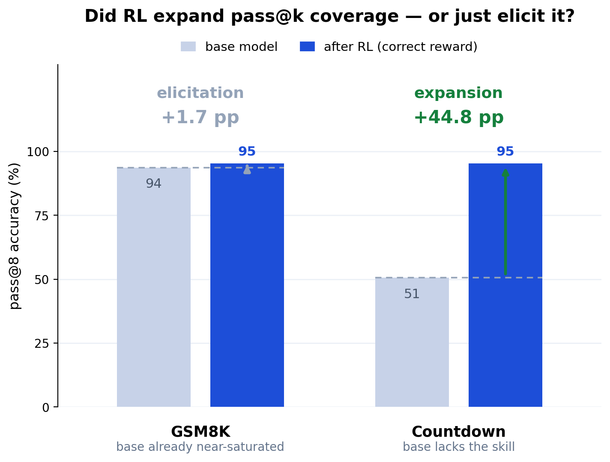

# grpo-decomp Countdown findings (general Qwen2.5-1.5B, GRPO on Countdown)

The **positive control**. Placebo comparison: **3 seeds per arm**; held-out `countdown-test`
(n=192, disjoint from train, procedurally generated so uncontaminated); pass@1 greedy. The
pass@k coverage panel is now **3 seeds** too (base n=16 / correct n=8, temp 0.7). Commit-pinned
artifacts: `seed-placebo-comparison.json`, `pass8-multiseed.json` (3-seed pass@k),
`elicitation.json` (historical seed-0 panel), `summary.json`, `decomposition.md`.

## Headline (controlled)

A **large (+46.5pp), correctness-driven, statistically significant** gain that is **genuine
capability expansion, not elicitation**: the trained model solves at pass@8 problems the
base cannot solve in 8 tries. This is the *contrast* to GSM8K, and it validates the
decomposition: the same instrument reads **elicitation** on GSM8K (a saturated benchmark)
and **expansion** here (a search task the base genuinely lacks).

## 1. Placebo comparison across seeds (the pre-registered confirmatory test)

correct − random, 3 seeds → mean **+46.5 pp**, 95% CI **[21.4, 71.6]** (seed-level t, df=2).
**Significant**: the interval excludes zero by a wide margin, and all 3 seeds are strongly
positive.

| seed | random | correct | Δ (pp) |
| --- | --- | --- | --- |
| 0 | 14.1% | 49.0% | +34.9 |
| 1 | 4.2% | 55.7% | +51.6 |
| 2 | 0.0% | 53.1% | +53.1 |

- **The correct arm learned the task.** From a base of ~11% pass@1 (§2) it reaches ~49–56%
  held-out pass@1, a skill the base genuinely lacked, not reliability on a skill it had.
- **The placebo genuinely doesn't help.** Random reward sits at 0–14% (≈ base or below; a
  correctness-blind reward can't teach search). Seed 2's random arm collapsed to 0%.
- Three seeds, not six: the effect is so large that the seed-level interval clears zero
  decisively (the GSM8K comparison needed six only because +3.9pp is small).

## 2. The pass@k curve: expansion, not elicitation (3 seeds, base n=16 / correct n=8, temp 0.7)

correct pass@8 over **3 seeds** vs the seed-independent base pass@8 anchor (`pass8-multiseed.json`):

| arm | pass@1 | pass@8 |
| --- | --- | --- |
| base | 11.0% | **53.6%** [48.4, 58.9] |
| correct (3-seed mean) | 58.0% | **94.6%** [91.9, 97.3] |

- **base pass@8 (53.6%) ≪ correct pass@8 (94.6%)**: pass@8 coverage **moved Δ +41.0 pp**,
  propagated 95% CI **[+35.1, +46.9]** (base anchor folded in; seed-level [38.3, 43.7]). The
  trained model solves at pass@8 problems the base fails even with 8 attempts: *new capability*,
  by definition outside the base's pass@k envelope.
- Contrast GSM8K, where Δ pass@8 = **+0.7 pp** (propagated **[−0.4, +1.9]**, consistent with
  zero): coverage barely moves, so the gain is elicitation. **Same decomposition, same protocol,
  opposite verdicts** — the propagated intervals (**[−0.4, +1.9]** vs **[+35.1, +46.9]**) do not
  come close to overlapping.

### Mechanism: real new capability, not just reliability

Per problem (`mechanism.json`, reliability threshold tau = 0.5): the base solves almost nothing
first-try-reliably (0.5%); the trained model makes **47.9%** migrated (within the base's pass@8
reach) and **10.9% genuinely new** (outside it). That **10.9% new-capability mass** is the
expansion signature GSM8K lacks (0.0% there). Completions also get *shorter* (366 → 315 words):
RL finds the target more directly, not by searching longer.

## 3. Two-sided validation (the point of the study)

| | GSM8K (Qwen2.5-Math-1.5B) | Countdown (general Qwen2.5-1.5B) |
| --- | --- | --- |
| placebo comparison (pass@1) | +3.9 pp [2.3, 5.6] (6 seeds) | **+46.5 pp [21.4, 71.6]** (3 seeds) |
| Δ pass@8 (propagated CI) | **+0.7 pp [−0.4, +1.9]** (6 seeds) | **+41.0 pp [+35.1, +46.9]** (3 seeds) |
| base → correct pass@8 | 94.0 → 94.7 | 53.6 → 94.6 |
| new-capability mass (mechanism) | **0.0%** | **10.9%** |
| verdict | **elicitation** (saturated base) | **expansion** (base lacked the skill) |

Both pass@8 rows are now seed-level (the panel was seed-0-only before) and their CIs fold in the
base anchor's own sampling uncertainty (propagated, not anchor-fixed); the intervals do not come
close to overlapping, so the contrast rests on neither a single draw nor a noiseless anchor.

The decomposition isn't biased toward "it's all fake": on a task where RL genuinely teaches
new ability, it reports expansion with higher pass@8 coverage; on a saturated benchmark it reports
elicitation. That two-sidedness is what makes the GSM8K "mostly elicitation" finding
trustworthy rather than a null-by-construction result.

## Bottom line

On Countdown — a verifiable, uncontaminated search task the base cannot do — GRPO with a
correctness reward delivers a **large, significant, genuinely-new-capability** gain (+46.5pp
placebo comparison; Δ pass@8 +41.0 pp, propagated [35.1, 46.9], coverage 53.6 → 94.6). It is the
positive control that proves the decomposition can detect expansion when it exists. Paired with GSM8K's
controlled elicitation result, the instrument is validated from both sides — now with both
pass@8 panels seed-level, not seed-0 draws.

## Caveats

- **3 seeds**: both the placebo comparison and the pass@8 panel clear their thresholds
  decisively, but the CIs are df=2; the point estimates are less precise than GSM8K's 6 seeds.
- **Within-Qwen, single base**: the placebo is a within-model lower bound on
  non-correctness-driven gain, not a cross-family verdict (a Llama arm is the follow-up).
- **Narrow task**: Countdown certifies that the *instrument* detects expansion; it does not
  claim broad reasoning transfer. It is the control, not a marquee capability result.
- **CoT-gated pass@k is uninformative here too**: chain coverage is 0.0% (Countdown completions
  do not emit `<<a op b = c>>` calculator steps either), so CoT-gated pass@8 is 0.0% for both
  arms — the same `<<>>`-proxy coverage limit as GSM8K, not a reasoning verdict. See
  `pass8-multiseed.json` (`base_chain_coverage`) and the GSM8K findings' CoT-gated section.
