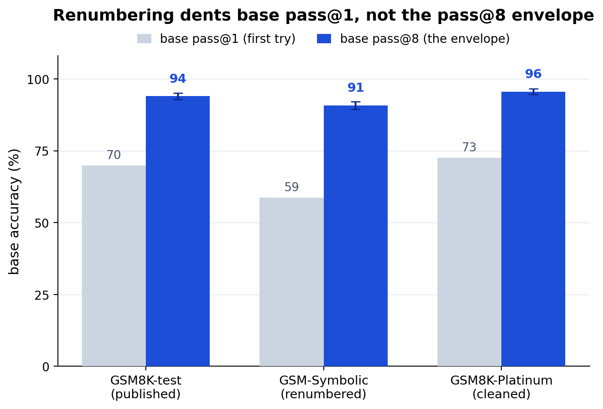

# grpo-gain-decomposition decontamination (the GSM8K elicitation finding off the memorizable distribution)

The skeptic's attack on the GSM8K headline: *"base pass@8 is 94% because Qwen2.5-Math memorized
GSM8K — your elicitation verdict is contamination, not latent reasoning."* This re-runs the
**multi-seed pass@8 panel** (the same checkpoints and decoding as the published one: base n=16 +
correct-seed{0..5} n=8, temp 0.7) on two distributions the base could not have memorized verbatim:

- **GSM-Symbolic** (`gsm-symbolic`, 1319 subsample matched to test size): the same templates with
  **renumbered** values, so memorized exact answers are wrong.
- **GSM8K-Platinum** (`gsm8k-platinum`, full 1209): GSM8K with **cleaned labels**, so the gain
  isn't an artifact of noisy gold.

Commit-pinned artifacts: `pass8-symbolic.json`, `pass8-platinum.json`.

## Headline: the elicitation verdict survives decontamination

**Base pass@8 does not collapse when the numbers change**, it stays far above correct pass@1, and
Δ pass@8 stays small. The "base already solves it at pass@8" structure is **genuine latent
capability, not memorized answers**.

| distribution | base pass@1 | base pass@8 | correct pass@1 | Δ pass@8 (propagated CI) |
| --- | --- | --- | --- | --- |
| gsm8k-test (published) | 69.8% | **94.0%** [92.9, 95.0] | 76.2% | +0.7 [−0.4, +1.9] |
| gsm-symbolic (renumbered) | 58.6% | **90.8%** [89.4, 92.1] | 63.8% | +1.8 [+0.2, +3.4] |
| gsm8k-platinum (cleaned) | 72.6% | **95.6%** [94.6, 96.5] | 78.8% | +0.8 [−0.3, +1.8] |

- **Renumbering barely dents the pass@8 envelope.** base pass@8 goes 94.0% → **90.8%** when every
  number changes. If the 94% were memorized answers, renumbering would crater it; it doesn't. The
  base genuinely *derives* these at pass@8.
- **Contamination is a pass@1 effect, not a pass@8 one.** Renumbering costs base pass@1 ~11 pp
  (69.8% → 58.6%) but base pass@8 only ~3 pp: memorization helps the *first* try, but the pass@8
  *envelope* — which the elicitation verdict rests on — is contamination-robust. The §3 greedy
  drop (76% → 63%) is real and lives at pass@1; it never touched the finding.
- **base pass@8 ≫ correct pass@1 holds, and widens.** The gap is **+27.0 pp** on renumbered
  problems (vs +17.7 on test): given 8 tries the base still solves far more than the trained model
  lands in one sampled try. The gain is reliability inside the base's existing reach.
- **Coverage still barely moves.** Δ pass@8 is +0.8 (platinum) to +1.8 (symbolic) pp. On the
  harder renumbered set the propagated interval clears zero (**[+0.2, +3.4]**) — a small, real
  coverage gain — but it is ~20x below Countdown's **+41.0 pp** expansion. Same instrument, same
  verdict: **elicitation, not expansion**, on every GSM8K distribution.

## Bottom line

The GSM8K elicitation finding is **not a contamination artifact**. Off the memorizable
distribution — renumbered values, cleaned labels — base pass@8 stays high (90.8–95.6%), stays far
above correct pass@1, and RL still moves pass@8 coverage by only ~1 pp. What contamination *does*
inflate is pass@1 (greedy first-try), exactly where the §3 controls already located it — and the
elicitation verdict never depended on pass@1.

## Caveats

- **CoT-gated reads 0 here too**: as on the main panel, chain coverage is 0.0% on these
  completions (Qwen reasons in code, not `<<a op b = c>>` steps), so CoT-gated pass@8 is 0.0% and
  uninformative — a proxy-coverage limit, recorded in the JSON, not a reasoning verdict.
- **gsm-symbolic is a 1319 subsample** (deterministic `dev_slice`, seed 0) chosen to match the
  test set's size so the base-anchor precision is comparable; the full set is 5000.
