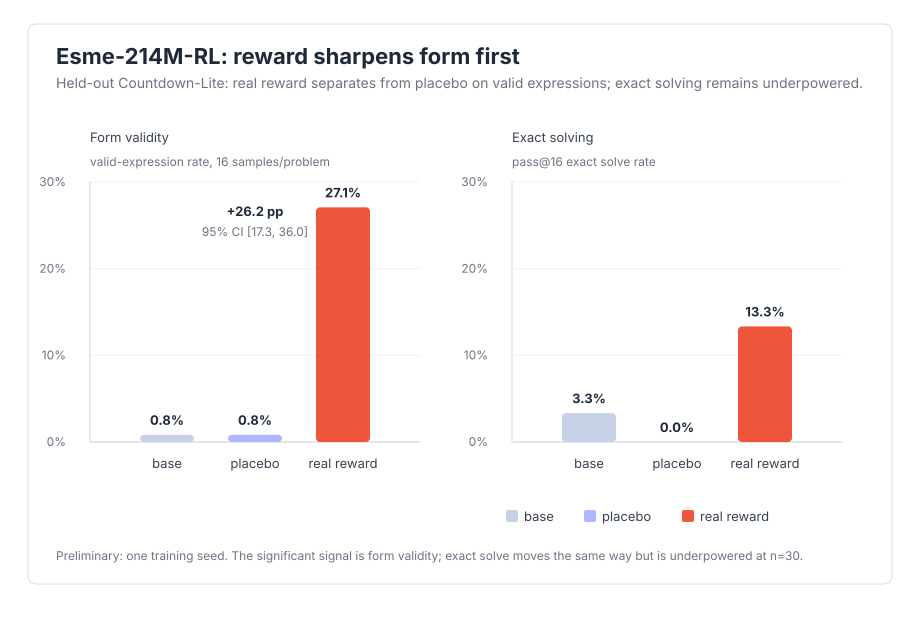

# Sampled decomposition — Esme-214M-RL on esme-countdown

Companion to the greedy `decomposition.md`. The greedy report scored one deterministic
sample per problem on exact-solve only. This report scores held-out Countdown-Lite with
sampling (**n=16, temperature 1.0**) and separates two axes:

- **valid-expression rate** — a legal Countdown-Lite expression using each supplied number
  once with `+ - *`, regardless of whether it reaches the target.
- **exact-solve pass@k** — the accepted solve metric, restored to a sampled estimate.

The 2026-07-05 result aggregates six real-reward GRPO seeds against six same-budget
random-reward placebo seeds. Produced by `scripts/esme_sampled_decomp.py`; raw numbers live
in `sampled_multiseed_summary.json`.

## Why this exists

For a 214M model on Countdown, greedy exact pass@1 is the lowest-power slice available:
the whole dynamic range was one or two solved problems. That made the original strict
report read as non-separable even though the accepted run's own sampled eval showed a
large validity/form shift.

Sampling and scoring validity match the reward ladder better. GRPO pays
`invalid 0.0 < valid-expression 0.3 < exact 1.0`, so the first place a real verifier
reward should separate from a random reward is well-formedness. The random-reward arm has
the same recipe and budget, but its reward is independent of task correctness.

## Result

Seed-level result, each seed on the same 30 held-out problems with 16 samples/problem:

| Seed | correct valid | random valid | Δ valid | correct any-exact | random any-exact |
| --- | ---: | ---: | ---: | ---: | ---: |
| 214 | 27.1% | 0.8% | +26.2pp | 4/30 | 0/30 |
| 215 | 97.7% | 0.4% | +97.3pp | 3/30 | 0/30 |
| 216 | 97.1% | 0.8% | +96.2pp | 3/30 | 1/30 |
| 217 | 97.1% | 0.6% | +96.5pp | 3/30 | 0/30 |
| 218 | 96.7% | 0.6% | +96.0pp | 3/30 | 1/30 |
| 219 | 96.9% | 1.2% | +95.6pp | 3/30 | 1/30 |

Aggregate arm means:

| Arm | valid-expr rate | pass@1 | pass@8 | pass@16 | any-exact solved |
| --- | ---: | ---: | ---: | ---: | ---: |
| base (Esme-214M-Chat) | 0.8% | 0.2% | 1.7% | 3.3% | 1/30 |
| correct (Esme-214M-RL, real reward) | 85.4% | 9.0% | 10.3% | 10.6% | 3.17/30 |
| random (placebo, random reward) | 0.8% | 0.1% | 0.8% | 1.7% | 0.50/30 |

Seed-level tests (unit = training seed, n=6):

| Axis | Comparison | Δ | 95% CI | test |
| --- | --- | ---: | --- | --- |
| valid-expr rate | correct vs random | **+84.7 pp** | **[+54.6, +114.7]** pp | seed-level t, df=5 |
| any-exact solve | correct vs random | **+8.9 pp** | **[+6.0, +11.7]** pp | seed-level t, df=5 |

Traceable headline strings: valid-expression rates are **85.4% vs 0.8%** for real reward
vs placebo; valid-expression separation is **+84.7 pp, 95% CI [+54.6, +114.7]**; any-exact
separation is **+8.9 pp, 95% CI [+6.0, +11.7]**.

Conclusion: **supported**. Real verifier reward separates from the random-reward placebo on
sampled held-out Countdown validity. Exact-any moves the same way and also clears zero
across seeds, but validity remains the honest headline because it is the reward rung with
the strongest signal and the most direct mechanism.

## Reading

The six-seed result is consistent: real reward lands near 97% valid-expression rate in five
of six seeds, while placebo stays near base in all six. The seed-level validity interval
clears zero with room to spare despite the low-validity seed 214.

The exact-solve axis is smaller but also positive across seeds: real reward averages 3.17
held-out problems with at least one exact sample, while placebo averages 0.50. This supports
the "RL sharpened form first, exact solving second" reading rather than a broad new reasoning
claim for a 214M model.

## Caveats

- **Six seeds, not a population law.** The seed-level CI is intentionally conservative and can
  extend above the physical probability ceiling because it is a small-n t interval on seed
  deltas. The important part is that its lower bound is positive.
- **Validity is form, not target solving.** A valid expression may still hit the wrong value.
  That is not a bug: validity is the rung the reward shaped most strongly, and exact-solving is
  reported separately.
- **Held-out fresh, short decode.** These are held-out problems at temperature 1.0 with a
  12-token budget. The in-distribution acceptance eval is a different slice; the cross-arm
  comparison here is apples-to-apples.
